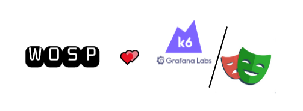

> #### ⚠️ This is currently an alpha version
>
> This is not supported by the k6 team, and is worked on by a(n) individual contributor(s).
> It may also break in the future as both xk6 and playwright-go evolve.
> Any issues with the tool should be raised [here](https://github.com/nicholasvuono/xk6-playwright/issues).
>
>It is not production ready yet, but definitely works as intended! Please enjoy the tool!

<br><br>
<div align="center">
   <br>
   <h1><b>xk6 playwright</b></h1><br>
   <p>k6 extension that adds support for browser automation and end-to-end web testing using <a href="https://github.com/mxschmitt/playwright-go" target="_blank">playwright-go</a></p>
   <p>Special thanks to all the contributors over at <a href="https://github.com/grafana/k6/graphs/contributors" target="_blank">k6</a> and <a href="https://github.com/mxschmitt/playwright-go/graphs/contributors" target="_blank">playwright-go</a>
   <p>Here's to open source!</p>

   <a href="https://github.com/nicholasvuono/xk6-playwright/releases"></a>
   <a href="https://goreportcard.com/report/github.com/wosp-io/xk6-playwright"></a>
   <a href="https://github.com/wosp-io/xk6-playwright/blob/main/LICENSE"></a>
</div>

----
This project was inspired by <a href="https://github.com/grafana/xk6-browser" target="_blank">xk6-browser</a>. Having seen the release we were excited to play around with the tool, but while using it we ran into some issues around context, page navigation, typing and button clicks. Having previously worked with <a href="https://github.com/mxschmitt/playwright-go" target="_blank">playwright-go</a> we thought it would be a great idea to create an extension around this so we had something we know would work to our liking. Thus <a href="https://github.com/wosp-io/xk6-playwright" target="_blank">xk6 playwright</a> was born!

NOTE: we totally understand at the time of writing this that xk6-browser is not yet production ready, and that it is currently an early beta that has been released to the public that will evolve and get better over time. However, we still saw validity in creating this extension aiming to support something we have used and know works to our liking. Competition is not intended, we just want to make cool things that help us do our jobs!

</br>

## Build from source

To build a `k6` binary with this extension, first ensure you have the prerequisites:

- [Go toolchain](https://go101.org/article/go-toolchain.html)
- Git
- Clone the k6 repository (NOTE: make sure you are in the k6 repo base directory before attempting the below steps)

Then:

1. Install `xk6`:
  ```shell
  go install go.k6.io/xk6/cmd/xk6@latest
  ```

2. Build the binary:
  ```shell
  xk6 build --output xk6-playwright --with github.com/wosp-io/xk6-playwright
  ```

  This will create a `xk6-playwright` binary file in the current working directory. This file can be used exactly the same as the main `k6` binary, with the addition of being able to run xk6-playwright scripts.

3. Run scripts that import `k6/x/playwright` with the new `xk6-playwright` binary. On Linux and macOS make sure this is done by referencing the file in the current directory, e.g. `./xk6-playwright run <script>`, or you can place it somewhere in your `PATH` so that it can be run from anywhere on your system.

</br>

## Simplest Working Example

```JavaScript
import pw from 'k6/x/playwright';

export default function () {
  pw.launch()
  pw.newPage()
  pw.goto("https://www.google.com/", {waitUntil: 'networkidle'})
  pw.waitForSelector("input[title='Search']", {state: 'visible'})
  pw.kill()
}
```

</br>

## Monitor Real User Metrics

```JavaScript
import pw from 'k6/x/playwright';

export default function () {
  pw.launch()
  pw.newPage()
  pw.goto("https://www.google.com/")
  pw.waitForSelector("input[title='Search']", {state: 'visible'})
  pw.type("input[title='Search']", "how to measure real user metrics with the xk6-playwright extension for k6?")

  //print out real user metrics of the google serach page
  console.log(`First Paint: ${pw.firstPaint()}ms`)
  console.log(`First Contentful Paint: ${pw.firstContentfulPaint()}ms`)
  console.log(`Time to Minimally Interactive: ${pw.timeToMinimallyInteractive()}ms`)
  console.log(`First Input Delay: ${pw.firstInputDelay()}ms`)

  pw.kill()
}
```

</br>

## Currently Supported Actions

[Playwright API](https://playwright.dev/docs/api/class-playwright) coverage is as follows:

| Action | Encompassed Playwright Function(s) | Description |
|   :---   | :--- | :--- |
| launch() | [`Run()`](https://pkg.go.dev/github.com/mxschmitt/playwright-go#Run) & [`Launch()`](https://pkg.go.dev/github.com/mxschmitt/playwright-go#BrowserType.Launch) | starts playwright client and launches browser|
| connect() | [`Run()`](https://pkg.go.dev/github.com/mxschmitt/playwright-go#Run) & [`Connect()`](https://pkg.go.dev/github.com/mxschmitt/playwright-go#BrowserType.Connect) | attaches playwright client to existing browser instance|
| newPage() | [`NewPage()`](https://pkg.go.dev/github.com/mxschmitt/playwright-go#Browser.NewPage) | opens up a new page within the browser |
| goto() | [`Goto()`](https://pkg.go.dev/github.com/mxschmitt/playwright-go#Page.Goto) | navigates to a specified url |
| waitForSelector() | [`WaitForSelector()`](https://pkg.go.dev/github.com/mxschmitt/playwright-go#Page.WaitForSelector) | waits for an element to be on the page based on the provided selector |
| click() | [`Click()`](https://pkg.go.dev/github.com/mxschmitt/playwright-go#Page.Click) | clicks an element on the page based on the provided selector |
| type() | [`Type()`](https://pkg.go.dev/github.com/mxschmitt/playwright-go#Page.Type) | types in an 'input' element on the page based on the provided selector and string to be entered |
| pressKey() | [`PressKey()`](https://pkg.go.dev/github.com/mxschmitt/playwright-go#Page.PressKey) | simulates pressing a key, types in an 'input' element on the page based on a key to be entered |
| sleep() | [`Sleep()`](https://pkg.go.dev/github.com/mxschmitt/playwright-go#Page.WaitForTimeout) | waits for a specified amount of time in milliseconds |
| screenshot() | [`Screenshot()`](https://pkg.go.dev/github.com/mxschmitt/playwright-go#Page.Screenshot) | attempts to take and save a png image of the current screen |
| focus() | [`Focus()`](https://pkg.go.dev/github.com/mxschmitt/playwright-go#Page.Focus) | focuses a spcific element based on the provided selector |
| fill() | [`Fill()`](https://pkg.go.dev/github.com/mxschmitt/playwright-go#Page.Fill) | fills an 'input' element on the page based on the provided selector and string to be entered |
| dragAndDrop() | [`DragAndDrop()`](https://pkg.go.dev/github.com/mxschmitt/playwright-go#Page.DragAndDrop) | drag an item from one place to another based on two selectors |
| evaluate() | [`Evaluate()`](https://pkg.go.dev/github.com/mxschmitt/playwright-go#Page.Evaluate) | evaluate an expresion or function and get the return value |
| reload() | [`Reload()`](https://pkg.go.dev/github.com/mxschmitt/playwright-go#Page.Reload) | reloads the current page |
| firstPaint() | N/A this function is unique to xk6-playwright [`What is First Paint?`](https://developer.mozilla.org/en-US/docs/Glossary/First_paint) | captures the first paint metric of the current page milliseconds |
| firstContentfulPaint() | N/A this function is unique to xk6-playwright [`What is First Contentful Paint?`](https://web.dev/fcp/) | captures the first contentful paint metric of the current page milliseconds |
| timeToMinimallyInteractive() | N/A this function is unique to xk6-playwright - This is based on the first input registerd on the current page - NOTE: this is how we personally like to determine when a page is minimally interactive. | captures the time to minimally interactive metric of the current page milliseconds |
| firstInputDelay() | N/A this function is unique to xk6-playwright [`What is First Input Delay?`](https://web.dev/fid/) | captures the first input delay metric of the current page in milliseconds |


NOTE: the above 'Encompassed Playwright Function(s)' will link to the [playwright-go package documentation](https://pkg.go.dev/github.com/mxschmitt/playwright-go#section-readme) to give an in-depth overview of how these functions will behave from a low-level perspective.

If you would like a high-level perspective on how these actions work you will be better served with the [Playwright API Documentation](https://playwright.dev/docs/api/class-playwright)

</br>

## Contributing

1. Fork it (<https://github.com/your-github-user/xk6-playwright/fork>)
2. Create your feature branch (`git checkout -b my-new-feature`)
3. Commit your changes (`git commit -am 'Add some feature'`)
4. Push to the branch (`git push origin my-new-feature`)
5. Create a new Pull Request

</br>

## Contributors

[Nick Vuono](https://github.com/nicholasvuono) - creator and maintainer
